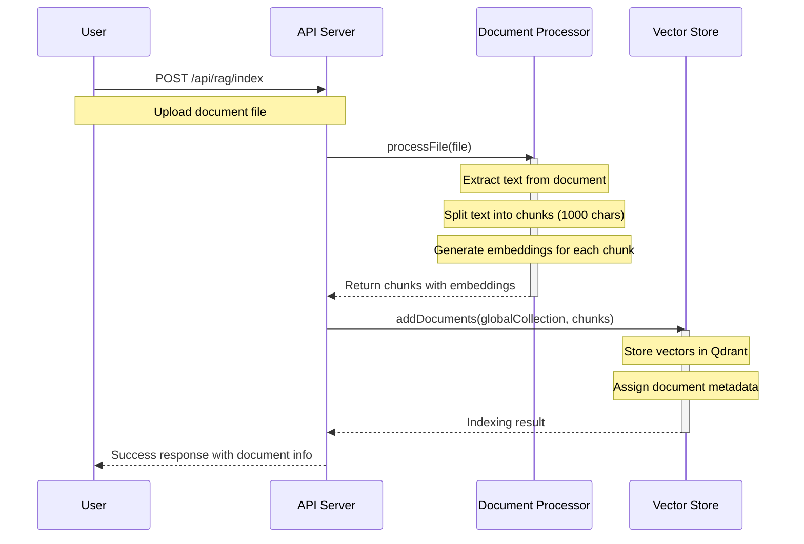
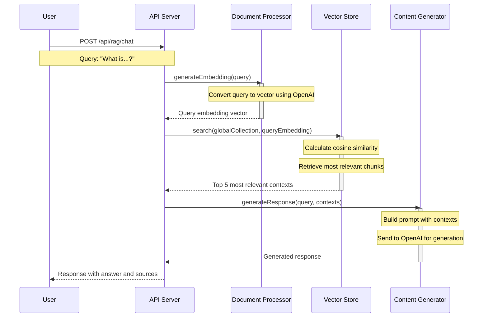

# RAG System API

A sample backend API demonstrating a RAG (Retrieval Augmented Generation) system for a Medium article.


## What is RAG?

Retrieval-Augmented Generation (RAG) is an AI framework that enhances large language models (LLMs) by providing them with additional context retrieved from a knowledge base. 


## Overview

This project implements a simple but functional RAG system with the following features:

- Document processing (text extraction, chunking, and embedding generation)
- Vector storage in Qdrant Cloud
- Content generation using OpenAI's GPT models
- RESTful API with Swagger documentation


## Technical Implementation

### RAG Generation Workflow

#### Document Indexing Process


#### Chat Process


### Document Processing

| Stage | Implementation | Notes |
|-------|---------------|-------|
| **Text Extraction** | Uses `pdf-parse` for PDFs<br>Uses `mammoth` for DOCX | Image-based content is referenced but not processed |
| **Chunking Strategy** | Paragraph-based with overlap | Default: 1000 char chunks with 200 char overlap |
| **Embedding Generation** | OpenAI's `text-embedding-ada-002` model | Fallback to mock embeddings when API unavailable |

### Vector Storage

| Feature | Implementation | Notes |
|---------|---------------|-------|
| **Vector Database** | Qdrant Cloud | Free tier supported |
| **Collection Structure** | Single global collection | All documents stored in the same space |
| **Vector Dimensions** | 1536 | Matches OpenAI embeddings |
| **Similarity Metric** | Cosine similarity | Default threshold: 0.7 |

### Content Generation

| Feature | Implementation | Notes |
|---------|---------------|-------|
| **LLM Provider** | OpenAI | Uses GPT-3.5 Turbo (default) |
| **Prompt Engineering** | System and user prompts | Carefully designed for educational content |
| **Fallback Strategy** | Mock content generation | When API is unavailable |
| **Rate Limiting** | Exponential backoff | Handles API throttling gracefully |

## API Endpoints

The API provides the following endpoints:

- `GET /api/status` - Check the status of the RAG system
- `POST /api/rag/index` - Index a document
- `POST /api/rag/chat` - Generate a chat response based on indexed documents

## Getting Started

### Prerequisites

- Node.js (v14 or later)
- npm or yarn
- OpenAI API key (for embedding generation and content generation)
- Qdrant Cloud account (or use the default demo credentials)

### Installation

1. Clone this repository:
   ```
   git clone https://github.com/yourusername/rag-system-api.git
   cd rag-system-api
   ```

2. Install dependencies:
   ```
   npm install
   ```

3. Create a `.env` file based on `.env.example`:
   ```
   cp .env.example .env
   ```

4. Update the `.env` file with your API keys.

5. Start the development server:
   ```
   npm run dev
   ```

6. Access the Swagger documentation at [http://localhost:3000/api-docs](http://localhost:3000/api-docs)

## Usage Examples

### Indexing a Document

```bash
curl -X POST \
  http://localhost:3000/api/rag/index \
  -H 'Content-Type: multipart/form-data' \
  -F 'document=@/path/to/your/document.pdf'
```

### Generating a Chat Response

```bash
curl -X POST \
  http://localhost:3000/api/rag/chat \
  -H 'Content-Type: application/json' \
  -d '{
    "query": "What are the key points in the document?"
  }'
```

## Architecture

The system follows a modular architecture:

- **Document Processor**: Handles text extraction, chunking, and embedding generation
- **Vector Store**: Manages vector embeddings and similarity search
- **Content Generator**: Generates responses based on retrieved context
- **RAG Service**: Coordinates the workflow between components
- **API Layer**: RESTful endpoints with Swagger documentation

## License

This project is licensed under the MIT License - see the LICENSE file for details.

## Acknowledgments

- OpenAI for their powerful embedding and LLM APIs
- Qdrant for their vector database
- All the open-source libraries used in this project
